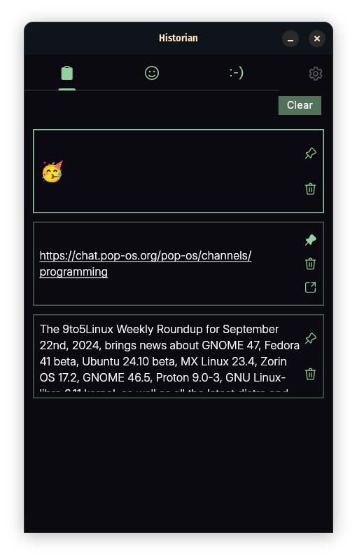
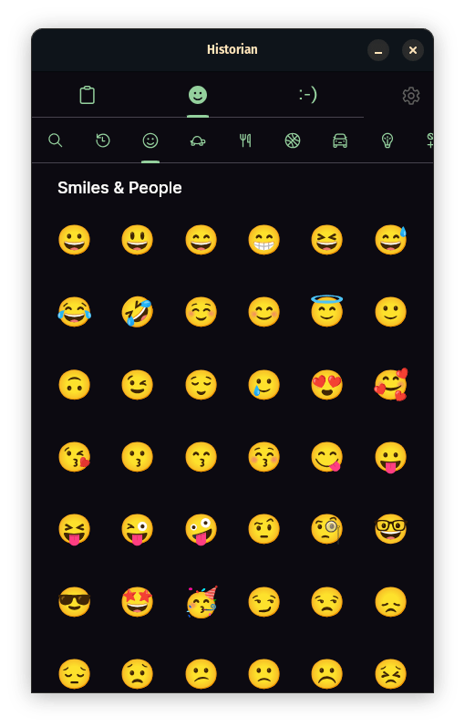
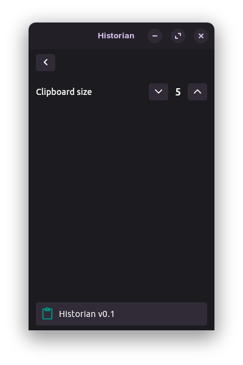
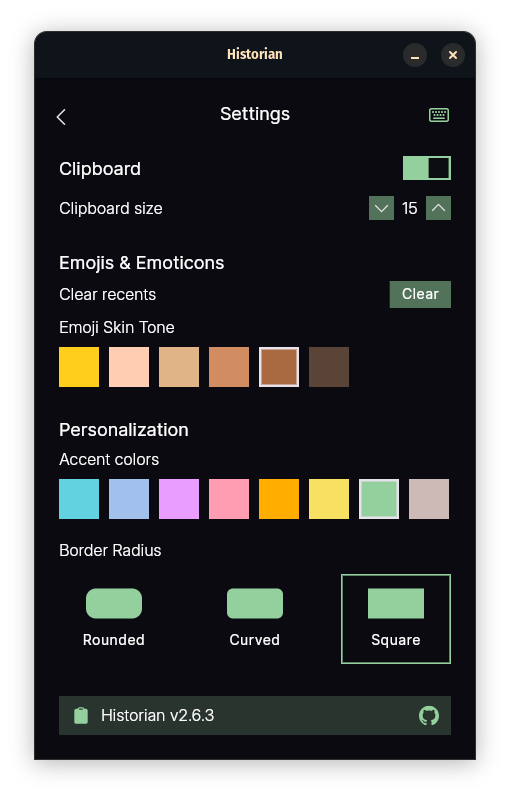
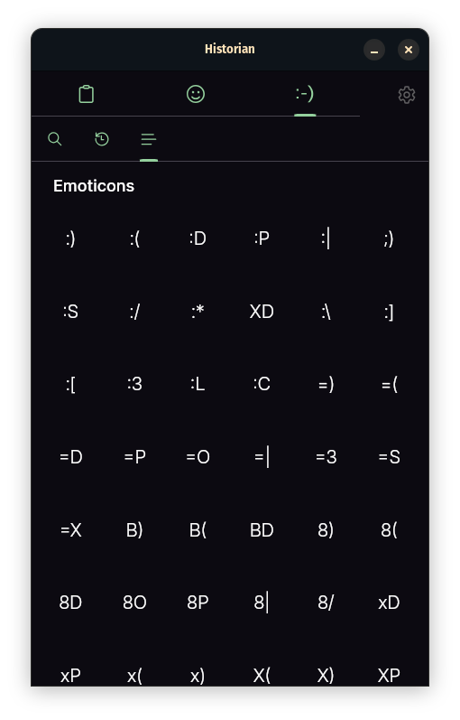

# Historian - A Clipboard Manager For Linux

**Historian** is a clipboard manager designed for Linux, built with Flutter. It provides an intuitive user interface and powerful features to manage clipboard history efficiently.

## Installation

#### Clone the repository using the following command:

```bash
git clone https://github.com/iamkartiknayak/Flutter_Historian.git
```

#### Rename the project directory before running flutter commands

```bash
mv Flutter_Historian historian
```

#### Navigate to the project directory:

```bash
cd historian
```

```bash
flutter pub get
```

#### Install wl-clipboard:

```bash
sudo apt install wl-clipboard zenity
```

#### Run the application:

```bash
flutter run
```


> ⚠️ **Image Support**  
> Firefox-based browsers work out of the box.  
> For Chromium-based browsers, make sure to enable **Wayland** or **Auto** mode under `chrome://flags` → **Preferred Ozone platform** for proper clipboard image support on Wayland.

## Features Working on

- [x] **Native Text Clipboard Listener**: Replaced dart clipboard listener with `wl-paste` (Wayland only).
- [x] **Image support**: Support for images.
- [ ] **Code Highlighting**: Supports syntax highlighting for code snippets.
- [ ] **GIF**: Support for GIF, Search & copy GIF to clipboard to be pasted in supported docx.
- [ ] **Filters**: Dynamic filters appear at the top based on copied content types, such as text, images, code or GIFs.

## Features Developed

### 1. Clipboard Tab

- [x] **Clipboard History**: Displays a list of items copied to the clipboard.
- [x] **Quick Copy**: Clicking on an item instantly copies it to the clipboard.
- [x] **Pin/Unpin Items**: Pin important items to prevent them from being cleared.
- [x] **Delete & Undo**: Remove items with the option to undo.
- [x] **Clear Clipboard**: Remove all unpinned items.
- [x] **Web Search**: Copied links will be auto detected & can be launched directly.

- [x] **Keyboard Shortcuts**:
  - `arrow-up /-down`: Navigate through clipboard items. Selected item is highlighted.
  - `Ctrl+C`: Copies the currently selected item to the clipboard.
  - `Ctrl+D`: Deletes the currently selected item.
  - `Ctrl+S`: Saves the currently selected image item~~.
  - `Ctrl+P`: Toggles the pin status of the selected item.
  - `Ctrl+U`: Undoes the last delete action, restoring the most recently deleted item.
  - `Ctrl+L`: Clear all unpinned items in clipboard.

### 2. Emoji Tab

- [x] **Category Tabbar**: Browse emojis by category, with options for search and recents.
- [x] **Searchbar**: Search for the required emoji using the searchbar at the top.
- [x] **Quick Copy**: Clicking on an emoji copies it to the clipboard.
- [x] **Keyboard Shortcut**:
  - `Ctrl+S`: Toggles the visibility of the searchbar.

### 3. Emoticon Tab

- [x] **Searchbar**: Search for the required emoticon using the searchbar at the top.
- [x] **Quick Copy**: Clicking on an emoticon copies it to the clipboard.
- [x] **Keyboard Shortcut**:
  - `Ctrl+S`: Toggles the visibility of the searchbar.

## Settings

Access the settings page through the settings button, offering various customization and control options:

- **Clipboard Settings**:

  - [x] Enable or disable clipboard monitoring (pause & resume).
  - [x] Adjust clipboard size (5-30) for optimized memory usage.

- **Emojis & Emoticons**:

  - [x] Clear recents in Emoji & Emoticon
  - [x] Emoji Skin Tone

- **Personalization Settings**:
  - [x] Customize the app theme color.
  - [x] Modify border radius for UI components.
  - [ ] Enable accent colors on the app background with custom values for a more personalized experience.

All configurations are saved and automatically loaded on the next app launch.

## App Tray

Historian app continue running in the bg while showing a tray icon for quick access and controls:

- [x] **Show/Hide Window**: Easily toggle the app window visibility.
- [x] **Pause/Resume Clipboard**: Enable or disable clipboard monitoring directly from the tray.
- [x] **Status Indicator**: The tray icon changes to indicate whether clipboard is listening or paused.

## Screenshots

&nbsp;&nbsp;&nbsp;
&nbsp;&nbsp;&nbsp;
&nbsp;&nbsp;&nbsp;
&nbsp;&nbsp;&nbsp;
<br><br>

### License

This project is licensed under the GPL3 License.

### Acknowledgements

The development of this app was made possible by the Flutter community's extensive resources. Special thanks to all those who contribute to the Flutter framework and its ecosystem.

Stay healthy and enjoy using the Historian app!
