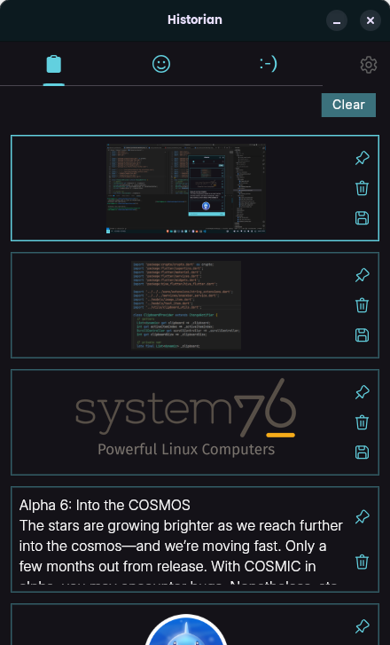

# Historian - Clipboard Manager for Linux

Historian is a versatile clipboard manager designed for Linux users, providing seamless handling of both text and image clipboard entries. This application allows users to efficiently manage and organize their clipboard history, offering features such as text and image copying, image saving to a user-defined location, and setting limits on the number of items stored in the clipboard.

### Features

- **Clipboard History:** Keep track of both text and image entries in your clipboard.
- **Text and Image Copying:** Copy text and images with ease, and have them readily available in your clipboard history.

- **Image Saving:** Save copied images to your desired location for future reference.

- **Clipboard Limit:** Set a limit to the number of items stored in the clipboard history, ensuring efficient management of resources.

### Installation

#### Clone the repository using the following command:

```bash
git clone https://github.com/iamkartiknayak/Flutter_Historian.git
```

#### Rename the project directory before running flutter commands

```bash
mv Flutter_Historian historian
```

#### Navigate to the project directory:

```bash
cd historian
```

#### Install the dependencies:

```bash
flutter pub get
```

#### Run the application:

```bash
flutter run
```

### Usage

- Launch Historian on your Linux system.
- Copy text or images, and they will be automatically added to your clipboard history.
- Save images to a specified location for later use.
- Set a limit on the number of items stored in the clipboard to manage resources efficiently.

### Screenshots

&nbsp;&nbsp;&nbsp;
&nbsp;&nbsp;&nbsp;
<br><br>

### License

This project is licensed under the GPL3 License.

### Acknowledgements

The development of this app was made possible by the Flutter community's extensive resources. Special thanks to all those who contribute to the Flutter framework and its ecosystem.

Stay healthy and enjoy using the Historian app!
